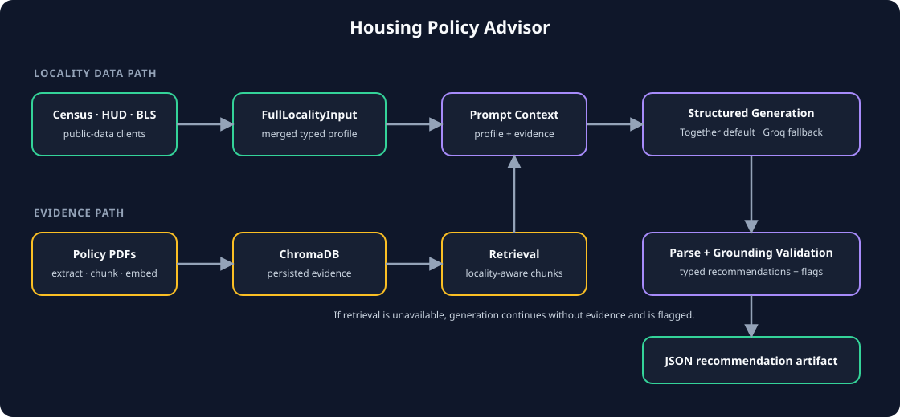

# Housing Policy Advisor

An evidence-aware recommendation pipeline for local housing-policy analysis. It builds a typed locality profile from public data, retrieves policy evidence from ChromaDB when available, asks an LLM for schema-constrained recommendations, and validates the resulting structure and grounding.

`Census + HUD + BLS · ChromaDB · Structured Generation · Grounding Validation`

[Architecture details](docs/architecture.md) · [Repository](https://github.com/rohanpc0701/housing-policy-advisor)



## Runtime flow

The recommendation path:

1. Census ACS, HUD USER, and BLS LAUS clients populate `FullLocalityInput`.
2. A locality-aware query retrieves evidence from a persisted Chroma collection.
3. The profile and evidence are sent to an OpenAI-compatible chat-completions provider.
4. The response is parsed into typed recommendation models.
5. Completeness, confidence, comparable-locality consistency, and evidence grounding are summarized in the JSON output.

The ingestion path extracts text from policy PDFs, chunks and embeds it with `sentence-transformers/all-MiniLM-L6-v2`, and persists the vectors in ChromaDB.

## Provider behavior

Together is the default provider. With `LLM_PROVIDER=together`, the router uses `TOGETHER_API_KEY`; if that key is absent and `GROQ_API_KEY` is present, it falls back to Groq. Set `LLM_PROVIDER=groq` to select Groq explicitly.

```bash
export TOGETHER_API_KEY="..."       # default path
# export GROQ_API_KEY="..."         # fallback or explicit provider
# export LLM_PROVIDER="groq"
```

At least one usable provider key is required for recommendation generation. No API credentials are committed to the repository.

## Data and retrieval configuration

```bash
export CENSUS_API_KEY="..."          # optional
export HUD_API_TOKEN="..."           # optional; HUD_API_KEY/HUD_TOKEN also work
export BLS_API_KEY="..."             # optional

export CHROMA_PERSIST_DIR="./chroma_db"
export CHROMA_COLLECTION_NAME="housing_policy_chunks"
```

Missing optional data-provider credentials produce a partial locality profile. If Chroma or its configured collection is unavailable, the pipeline still generates recommendations without retrieved evidence and adds `rag_unavailable` validation flags; this is a degraded path, not an evidence-grounded result.

## Install and run

Python 3.10+ is recommended.

```bash
python3 -m pip install -r housing_policy_advisor/requirements.txt

python3 -m housing_policy_advisor \
  --locality "Montgomery County" \
  --state "Virginia" \
  --state-fips 51 \
  --county-fips 121 \
  --governance-form county \
  --state-abbr va \
  --retrieval-k 15 \
  --format json \
  --out-dir .
```

The command writes `policy_recommendations_montgomery_county_va.json`. `--format table` and `--format narrative` also write a readable text view alongside the JSON artifact.

## Build the evidence store

```bash
python3 -m housing_policy_advisor.rag.ingest \
  --source-dir academic=corpus/academic \
  --source-dir case_studies=corpus/case_studies \
  --source-dir fed_regulatory=corpus/Fed_and_regulatory \
  --source-dir implementation_toolkit=corpus/implementation_toolkit
```

Use `--dry-run` to process documents without writing to Chroma, `--limit N` for a bounded run, or `--reset` to rebuild the configured collection. Runtime retrieval and ingestion must use the same embedding model.

## Tests

The suite uses mocked external services; it does not require live provider calls.

```bash
python3 -m pytest -q
```

This repository does not claim production readiness or publish portfolio-only performance metrics. Experiment notes under `docs/` record both successful and blocked live runs, including provider quota and grounding failures.
